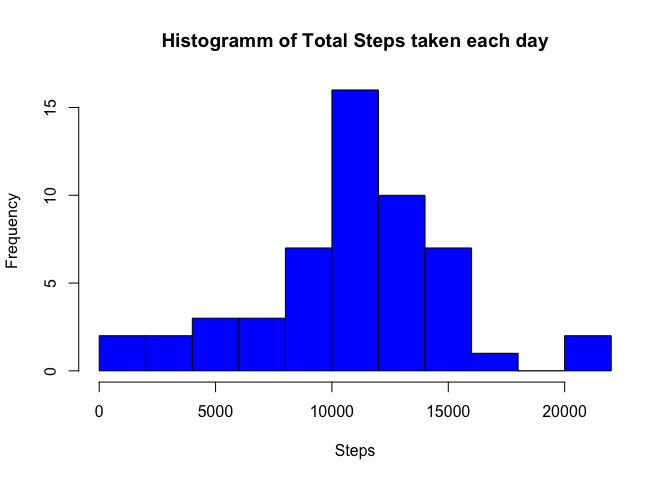
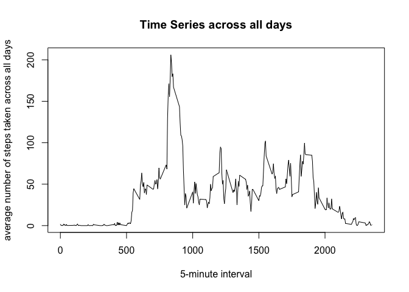
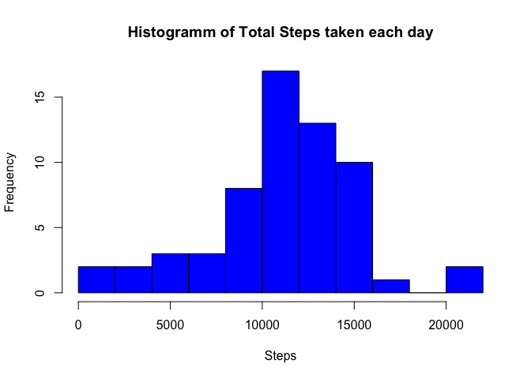
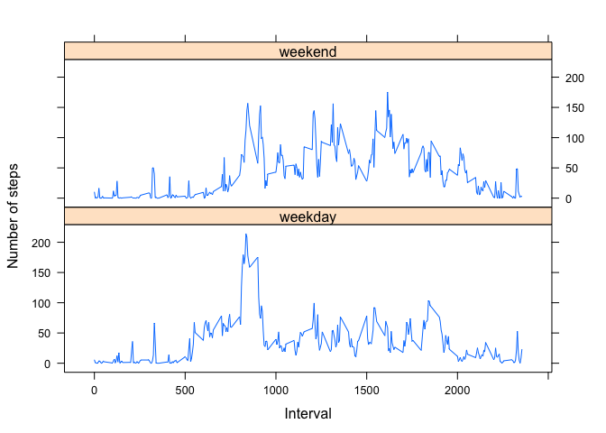

Loading and preprocessing the data

Show any code that is needed to

Load the data (i.e. 𝚛𝚎𝚊𝚍.𝚌𝚜𝚟()) Process/transform the data (if
necessary) into a format suitable for your analysis

    #load packages 

    library (graphics)

    #Read Csv
    ?read.csv
    read.csv("/Users/buro/Documents/Promotion/Courses/Data_Science_Specialisation/Reproducible_Research_ 5/Assignment/1/activity.csv", header = TRUE, sep = ",",
        colClasses=c("steps"="numeric")
               ) -> activity

    #keep only the complete cases
    na.omit(activity) ->activitycomp

    class(activitycomp$steps)

    ## [1] "numeric"

What is mean total number of steps taken per day?

For this part of the assignment, you can ignore the missing values in
the dataset.

Calculate the total number of steps taken per day If you do not
understand the difference between a histogram and a barplot, research
the difference between them. Make a histogram of the total number of
steps taken each day Calculate and report the mean and median of the
total number of steps taken per day.

Answers: The mean of the total number of steps is: 10766.19 Steps The
median is: 10765

    #get overview of data
    head(activitycomp)

    ##     steps       date interval
    ## 289     0 2012-10-02        0
    ## 290     0 2012-10-02        5
    ## 291     0 2012-10-02       10
    ## 292     0 2012-10-02       15
    ## 293     0 2012-10-02       20
    ## 294     0 2012-10-02       25

    tail(activitycomp)

    ##       steps       date interval
    ## 17275     0 2012-11-29     2330
    ## 17276     0 2012-11-29     2335
    ## 17277     0 2012-11-29     2340
    ## 17278     0 2012-11-29     2345
    ## 17279     0 2012-11-29     2350
    ## 17280     0 2012-11-29     2355

    summary(activitycomp)

    ##      steps                date          interval     
    ##  Min.   :  0.00   2012-10-02:  288   Min.   :   0.0  
    ##  1st Qu.:  0.00   2012-10-03:  288   1st Qu.: 588.8  
    ##  Median :  0.00   2012-10-04:  288   Median :1177.5  
    ##  Mean   : 37.38   2012-10-05:  288   Mean   :1177.5  
    ##  3rd Qu.: 12.00   2012-10-06:  288   3rd Qu.:1766.2  
    ##  Max.   :806.00   2012-10-07:  288   Max.   :2355.0  
    ##                   (Other)   :13536

    #Sum of taken steps per day

    aggsteps <- aggregate(activitycomp$steps, by= list(activitycomp$date), FUN = sum) 

    #Write the correct names

    names(aggsteps) <- c("date", "stepstot")

    head(aggsteps)

    ##         date stepstot
    ## 1 2012-10-02      126
    ## 2 2012-10-03    11352
    ## 3 2012-10-04    12116
    ## 4 2012-10-05    13294
    ## 5 2012-10-06    15420
    ## 6 2012-10-07    11015

    #Prepare Histogramm
    class(aggsteps$Group.1)

    ## [1] "NULL"

    aggsteps$date = as.Date(aggsteps$date) 

    head(aggsteps)

    ##         date stepstot
    ## 1 2012-10-02      126
    ## 2 2012-10-03    11352
    ## 3 2012-10-04    12116
    ## 4 2012-10-05    13294
    ## 5 2012-10-06    15420
    ## 6 2012-10-07    11015

    #Create Histogramm
    hist(aggsteps$stepstot, freq = TRUE,
         main = "Histogramm of Total Steps taken each day", 
         xlab = "Steps",
         breaks = 10,
         col = "blue")

    #Calculate the mean steps
    mean(aggsteps$stepstot)

    ## [1] 10766.19

    #Calculate median steps
    median(aggsteps$stepstot)

    ## [1] 10765

What is the average daily activity pattern?

Make a time series plot (i.e. 𝚝𝚢𝚙𝚎 = "𝚕") of the 5-minute interval
(x-axis) and the average number of steps taken, averaged across all days
(y-axis) Which 5-minute interval, on average across all the days in the
dataset, contains the maximum number of steps?

Answer: The five minute interval 835 contains the maximum number of
steps.

    head(activitycomp)

    ##     steps       date interval
    ## 289     0 2012-10-02        0
    ## 290     0 2012-10-02        5
    ## 291     0 2012-10-02       10
    ## 292     0 2012-10-02       15
    ## 293     0 2012-10-02       20
    ## 294     0 2012-10-02       25

    aggtime <- aggregate(activitycomp$steps, by= list(activitycomp$interval), FUN = mean) 

    head(aggtime)

    ##   Group.1         x
    ## 1       0 1.7169811
    ## 2       5 0.3396226
    ## 3      10 0.1320755
    ## 4      15 0.1509434
    ## 5      20 0.0754717
    ## 6      25 2.0943396

    plot(aggtime, type = "l",
         main = "Time Series across all days", 
         xlab= "5-minute interval", 
         ylab= "average number of steps taken across all days")

    #Which 5-minute interval, on average across all the days in the dataset, contains the maximum number of steps?

    summary(aggtime)

    ##     Group.1             x          
    ##  Min.   :   0.0   Min.   :  0.000  
    ##  1st Qu.: 588.8   1st Qu.:  2.486  
    ##  Median :1177.5   Median : 34.113  
    ##  Mean   :1177.5   Mean   : 37.383  
    ##  3rd Qu.:1766.2   3rd Qu.: 52.835  
    ##  Max.   :2355.0   Max.   :206.170

    #Find the position of the max

    aggtime[which.max(aggtime$x),]

    ##     Group.1        x
    ## 104     835 206.1698

Imputing missing values

Note that there are a number of days/intervals where there are missing
values (coded as 𝙽𝙰). The presence of missing days may introduce bias
into some calculations or summaries of the data.

Calculate and report the total number of missing values in the dataset
(i.e. the total number of rows with 𝙽𝙰s) Devise a strategy for filling
in all of the missing values in the dataset. The strategy does not need
to be sophisticated. For example, you could use the mean/median for that
day, or the mean for that 5-minute interval, etc. Create a new dataset
that is equal to the original dataset but with the missing data filled
in. Make a histogram of the total number of steps taken each day and
Calculate and report the mean and median total number of steps taken per
day. Do these values differ from the estimates from the first part of
the assignment? What is the impact of imputing missing data on the
estimates of the total daily number of steps?

Answer: Before the Imputation there are 2304 missing Values. Afterwards
they are gone. The values differ from the analysis before. The median
and the mean are now higher. Total number of steps a day are now
estimated higher than before.

    library("mice")

    ## Loading required package: Rcpp
    ## mice 2.25 2015-11-09

    #Find out the different imputation methods
    methods(mice)

    ## Warning in .S3methods(generic.function, class, parent.frame()): function
    ## 'mice' appears not to be S3 generic; found functions that look like S3
    ## methods

    ##  [1] mice.impute.2l.norm      mice.impute.2l.pan      
    ##  [3] mice.impute.2lonly.mean  mice.impute.2lonly.norm 
    ##  [5] mice.impute.2lonly.pmm   mice.impute.cart        
    ##  [7] mice.impute.fastpmm      mice.impute.lda         
    ##  [9] mice.impute.logreg       mice.impute.logreg.boot 
    ## [11] mice.impute.mean         mice.impute.norm        
    ## [13] mice.impute.norm.boot    mice.impute.norm.nob    
    ## [15] mice.impute.norm.predict mice.impute.passive     
    ## [17] mice.impute.pmm          mice.impute.polr        
    ## [19] mice.impute.polyreg      mice.impute.quadratic   
    ## [21] mice.impute.rf           mice.impute.ri          
    ## [23] mice.impute.sample       mice.mids               
    ## [25] mice.theme              
    ## see '?methods' for accessing help and source code

    #Imputate using predictive mean matching
    #0. Check na. 
    sum(is.na(activity))

    ## [1] 2304

    #1. Step: Create temporary data with predictive mean matching
    tempData <- mice(activity,m=5,maxit=50,meth='pmm',seed=500)

    ## 
    ##  iter imp variable
    ##   1   1  steps
    ##   1   2  steps
    ##   1   3  steps
    ##   1   4  steps
    ##   1   5  steps
    ##   2   1  steps
    ##   2   2  steps
    ##   2   3  steps
    ##   2   4  steps
    ##   2   5  steps
    ##   3   1  steps
    ##   3   2  steps
    ##   3   3  steps
    ##   3   4  steps
    ##   3   5  steps
    ##   4   1  steps
    ##   4   2  steps
    ##   4   3  steps
    ##   4   4  steps
    ##   4   5  steps
    ##   5   1  steps
    ##   5   2  steps
    ##   5   3  steps
    ##   5   4  steps
    ##   5   5  steps
    ##   6   1  steps
    ##   6   2  steps
    ##   6   3  steps
    ##   6   4  steps
    ##   6   5  steps
    ##   7   1  steps
    ##   7   2  steps
    ##   7   3  steps
    ##   7   4  steps
    ##   7   5  steps
    ##   8   1  steps
    ##   8   2  steps
    ##   8   3  steps
    ##   8   4  steps
    ##   8   5  steps
    ##   9   1  steps
    ##   9   2  steps
    ##   9   3  steps
    ##   9   4  steps
    ##   9   5  steps
    ##   10   1  steps
    ##   10   2  steps
    ##   10   3  steps
    ##   10   4  steps
    ##   10   5  steps
    ##   11   1  steps
    ##   11   2  steps
    ##   11   3  steps
    ##   11   4  steps
    ##   11   5  steps
    ##   12   1  steps
    ##   12   2  steps
    ##   12   3  steps
    ##   12   4  steps
    ##   12   5  steps
    ##   13   1  steps
    ##   13   2  steps
    ##   13   3  steps
    ##   13   4  steps
    ##   13   5  steps
    ##   14   1  steps
    ##   14   2  steps
    ##   14   3  steps
    ##   14   4  steps
    ##   14   5  steps
    ##   15   1  steps
    ##   15   2  steps
    ##   15   3  steps
    ##   15   4  steps
    ##   15   5  steps
    ##   16   1  steps
    ##   16   2  steps
    ##   16   3  steps
    ##   16   4  steps
    ##   16   5  steps
    ##   17   1  steps
    ##   17   2  steps
    ##   17   3  steps
    ##   17   4  steps
    ##   17   5  steps
    ##   18   1  steps
    ##   18   2  steps
    ##   18   3  steps
    ##   18   4  steps
    ##   18   5  steps
    ##   19   1  steps
    ##   19   2  steps
    ##   19   3  steps
    ##   19   4  steps
    ##   19   5  steps
    ##   20   1  steps
    ##   20   2  steps
    ##   20   3  steps
    ##   20   4  steps
    ##   20   5  steps
    ##   21   1  steps
    ##   21   2  steps
    ##   21   3  steps
    ##   21   4  steps
    ##   21   5  steps
    ##   22   1  steps
    ##   22   2  steps
    ##   22   3  steps
    ##   22   4  steps
    ##   22   5  steps
    ##   23   1  steps
    ##   23   2  steps
    ##   23   3  steps
    ##   23   4  steps
    ##   23   5  steps
    ##   24   1  steps
    ##   24   2  steps
    ##   24   3  steps
    ##   24   4  steps
    ##   24   5  steps
    ##   25   1  steps
    ##   25   2  steps
    ##   25   3  steps
    ##   25   4  steps
    ##   25   5  steps
    ##   26   1  steps
    ##   26   2  steps
    ##   26   3  steps
    ##   26   4  steps
    ##   26   5  steps
    ##   27   1  steps
    ##   27   2  steps
    ##   27   3  steps
    ##   27   4  steps
    ##   27   5  steps
    ##   28   1  steps
    ##   28   2  steps
    ##   28   3  steps
    ##   28   4  steps
    ##   28   5  steps
    ##   29   1  steps
    ##   29   2  steps
    ##   29   3  steps
    ##   29   4  steps
    ##   29   5  steps
    ##   30   1  steps
    ##   30   2  steps
    ##   30   3  steps
    ##   30   4  steps
    ##   30   5  steps
    ##   31   1  steps
    ##   31   2  steps
    ##   31   3  steps
    ##   31   4  steps
    ##   31   5  steps
    ##   32   1  steps
    ##   32   2  steps
    ##   32   3  steps
    ##   32   4  steps
    ##   32   5  steps
    ##   33   1  steps
    ##   33   2  steps
    ##   33   3  steps
    ##   33   4  steps
    ##   33   5  steps
    ##   34   1  steps
    ##   34   2  steps
    ##   34   3  steps
    ##   34   4  steps
    ##   34   5  steps
    ##   35   1  steps
    ##   35   2  steps
    ##   35   3  steps
    ##   35   4  steps
    ##   35   5  steps
    ##   36   1  steps
    ##   36   2  steps
    ##   36   3  steps
    ##   36   4  steps
    ##   36   5  steps
    ##   37   1  steps
    ##   37   2  steps
    ##   37   3  steps
    ##   37   4  steps
    ##   37   5  steps
    ##   38   1  steps
    ##   38   2  steps
    ##   38   3  steps
    ##   38   4  steps
    ##   38   5  steps
    ##   39   1  steps
    ##   39   2  steps
    ##   39   3  steps
    ##   39   4  steps
    ##   39   5  steps
    ##   40   1  steps
    ##   40   2  steps
    ##   40   3  steps
    ##   40   4  steps
    ##   40   5  steps
    ##   41   1  steps
    ##   41   2  steps
    ##   41   3  steps
    ##   41   4  steps
    ##   41   5  steps
    ##   42   1  steps
    ##   42   2  steps
    ##   42   3  steps
    ##   42   4  steps
    ##   42   5  steps
    ##   43   1  steps
    ##   43   2  steps
    ##   43   3  steps
    ##   43   4  steps
    ##   43   5  steps
    ##   44   1  steps
    ##   44   2  steps
    ##   44   3  steps
    ##   44   4  steps
    ##   44   5  steps
    ##   45   1  steps
    ##   45   2  steps
    ##   45   3  steps
    ##   45   4  steps
    ##   45   5  steps
    ##   46   1  steps
    ##   46   2  steps
    ##   46   3  steps
    ##   46   4  steps
    ##   46   5  steps
    ##   47   1  steps
    ##   47   2  steps
    ##   47   3  steps
    ##   47   4  steps
    ##   47   5  steps
    ##   48   1  steps
    ##   48   2  steps
    ##   48   3  steps
    ##   48   4  steps
    ##   48   5  steps
    ##   49   1  steps
    ##   49   2  steps
    ##   49   3  steps
    ##   49   4  steps
    ##   49   5  steps
    ##   50   1  steps
    ##   50   2  steps
    ##   50   3  steps
    ##   50   4  steps
    ##   50   5  steps

    summary(tempData)

    ## Multiply imputed data set
    ## Call:
    ## mice(data = activity, m = 5, method = "pmm", maxit = 50, seed = 500)
    ## Number of multiple imputations:  5
    ## Missing cells per column:
    ##    steps     date interval 
    ##     2304        0        0 
    ## Imputation methods:
    ##    steps     date interval 
    ##    "pmm"    "pmm"    "pmm" 
    ## VisitSequence:
    ## steps 
    ##     1 
    ## PredictorMatrix:
    ##          steps date interval
    ## steps        0    1        1
    ## date         0    0        0
    ## interval     0    0        0
    ## Random generator seed value:  500

    #2. Step. Complete the dataset
    completedData <- complete(tempData,1)

    #3. Step: Check na. 
    sum(is.na(completedData))

    ## [1] 0

    head(activity)

    ##   steps       date interval
    ## 1    NA 2012-10-01        0
    ## 2    NA 2012-10-01        5
    ## 3    NA 2012-10-01       10
    ## 4    NA 2012-10-01       15
    ## 5    NA 2012-10-01       20
    ## 6    NA 2012-10-01       25

    ##Make a histogram of the total number of steps taken each day
    #and Calculate and report the mean and median total number of steps taken per day.
    #Do these values differ from the estimates from the first part of the assignment?
    #What is the impact of imputing missing data on the estimates of the total daily number of steps?

    aggscomsteps <- aggregate(completedData$steps, by= list(completedData$date), FUN = sum) 

    #Write the correct names

    names(aggscomsteps) <- c("date", "stepstot")

    head(aggscomsteps)

    ##         date stepstot
    ## 1 2012-10-01    15298
    ## 2 2012-10-02      126
    ## 3 2012-10-03    11352
    ## 4 2012-10-04    12116
    ## 5 2012-10-05    13294
    ## 6 2012-10-06    15420

    #Prepare Histogramm
    class(aggscomsteps$Group.1)

    ## [1] "NULL"

    aggscomsteps$date = as.Date(aggscomsteps$date) 

    head(aggscomsteps)

    ##         date stepstot
    ## 1 2012-10-01    15298
    ## 2 2012-10-02      126
    ## 3 2012-10-03    11352
    ## 4 2012-10-04    12116
    ## 5 2012-10-05    13294
    ## 6 2012-10-06    15420

    #Create Histogramm
    hist(aggscomsteps$stepstot, freq = TRUE,
         main = "Histogramm of Total Steps taken each day", 
         xlab = "Steps",
         breaks = 10,
         col = "blue")

    #Calculate the mean steps
    mean(aggscomsteps$stepstot)

    ## [1] 11073.54

    #Calculate median steps
    median(aggscomsteps$stepstot)

    ## [1] 11162

Are there differences in activity patterns between weekdays and
weekends?

For this part the 𝚠𝚎𝚎𝚔𝚍𝚊𝚢𝚜() function may be of some help here. Use the
dataset with the filled-in missing values for this part.

Create a new factor variable in the dataset with two levels – “weekday”
and “weekend” indicating whether a given date is a weekday or weekend
day. Make a panel plot containing a time series plot (i.e. 𝚝𝚢𝚙𝚎 = "𝚕")
of the 5-minute interval (x-axis) and the average number of steps taken,
averaged across all weekday days or weekend days (y-axis). See the
README file in the GitHub repository to see an example of what this plot
should look like using simulated data.

Answer: On weekends the user tends to be more active throughout thw
whole day, whereas on weekdays he seems to be mainly active in the
morning hours.

    class(completedData$date)

    ## [1] "factor"

    completedData$date <- as.Date(completedData$date)

    #Add weekdays to Data Frame
    weekdays(completedData$date) -> completedData$Wk

    completedData$Wk =as.factor(completedData$Wk) 

    # Divide Weekdays in Week and Weekend

    levels(completedData$Wk) <- list(weekday = c("Montag", "Dienstag",
                                                 "Mittwoch", 
                                                 "Donnerstag", "Freitag"),
                                     weekend = c("Samstag", "Sonntag"))
    levels(completedData$Wk)

    ## [1] "weekday" "weekend"

    summary(completedData)

    ##      steps             date               interval            Wk       
    ##  Min.   :  0.00   Min.   :2012-10-01   Min.   :   0.0   weekday:12960  
    ##  1st Qu.:  0.00   1st Qu.:2012-10-16   1st Qu.: 588.8   weekend: 4608  
    ##  Median :  0.00   Median :2012-10-31   Median :1177.5                  
    ##  Mean   : 38.45   Mean   :2012-10-31   Mean   :1177.5                  
    ##  3rd Qu.: 14.00   3rd Qu.:2012-11-15   3rd Qu.:1766.2                  
    ##  Max.   :806.00   Max.   :2012-11-30   Max.   :2355.0

    #Make a panel plot containing a time series plot (i.e. type = "l") of the 5-minute interval (x-axis) 
    #and the average number of steps taken, averaged across all weekday days or weekend days (y-axis). 

    # Create aggregate steps for the weekend + weekdays

    avActData <- aggregate(steps ~ interval + Wk, data=completedData, mean)

    summary(avActData)

    ##     interval            Wk          steps        
    ##  Min.   :   0.0   weekday:288   Min.   :  0.000  
    ##  1st Qu.: 588.8   weekend:288   1st Qu.:  5.476  
    ##  Median :1177.5                 Median : 31.689  
    ##  Mean   :1177.5                 Mean   : 39.994  
    ##  3rd Qu.:1766.2                 3rd Qu.: 60.672  
    ##  Max.   :2355.0                 Max.   :214.333

    # Plot the Graphs
    library(lattice)
    plot <- xyplot(avActData$steps ~ avActData$interval | avActData$Wk, 
                    layout = c(1, 2), type = "l", 
                    xlab = "Interval", ylab = "Number of steps")
    plot

